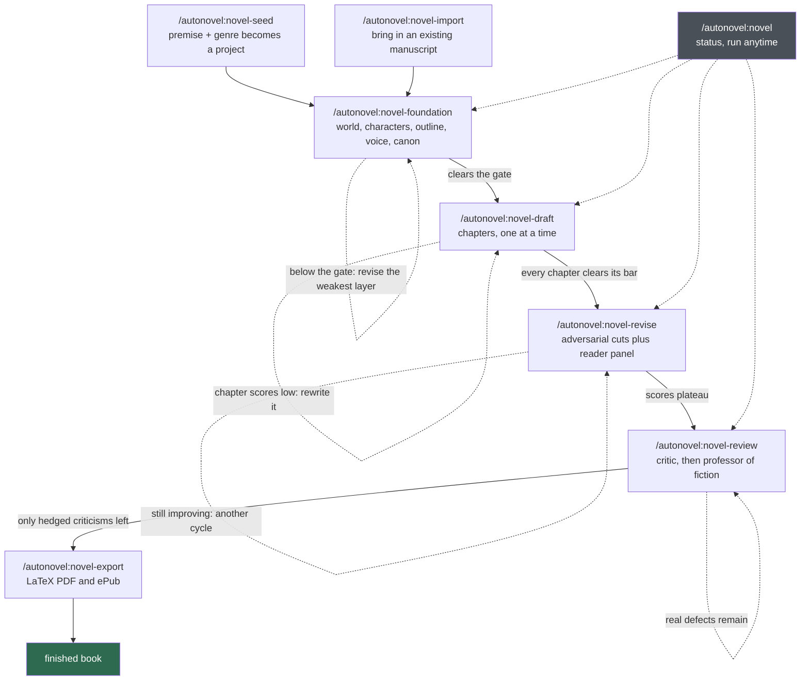

# autonovel

Write a complete novel with Claude Code. You supply a premise; a pipeline of
skills builds the world, drafts the chapters, revises them against a panel of
critics, and typesets a print-ready PDF and ePub.

It is not a one-shot prompt. Each phase runs a **modify → evaluate →
keep-or-discard** loop against a rubric, the way
[karpathy/autoresearch](https://github.com/karpathy/autoresearch) does for
research — so the book gets measurably better between iterations instead of
just getting longer.

Fifteen **genre packs** ship — general fiction, fantasy, science fiction,
romance, mystery, thriller, erotica, romantasy, paranormal romance, romantic
suspense and dark romance, plus YA, cozy, historical and inspirational as
modifiers you layer on top. The genre decides what the judges score, how the
book is weighted, and how long a chapter should be — a thriller drafts in
1,900-word chapters, a romantasy in 2,600, a fantasy in 3,200.

---

## Install

Requires [Claude Code](https://claude.com/claude-code). No API keys for the
writing pipeline.

Add the marketplace, then install the plugin:

```
abnormalend/autonovel
```

In Claude Code CLI:

```bash
/plugin marketplace add abnormalend/autonovel
```

```bash
/plugin install autonovel@autonovel-dev
```

Verify you got it:

```bash
python3 -c "
import json,os,pathlib
d=json.loads((pathlib.Path.home()/'.claude/plugins/installed_plugins.json').read_text())
e=d['plugins']['autonovel@autonovel-dev'][0]
g=os.path.join(e['installPath'],'shared','genres')
print('version:', e['version'])
print('packs  :', len([f for f in os.listdir(g) if f.endswith('.md')])-1 if os.path.isdir(g) else 'MISSING')
"
```

You want `0.3.0` and `15`.

---

## Quick start

```bash
/autonovel:novel-seed
```

It asks three things — where the project should live, what genre, and your
premise — then scaffolds a project with its own private git repo. Your novel
never lives inside this repo.

```bash
cd ~/novels/your-book
/autonovel:novel-foundation
```

That runs until the plan is good enough to draft from, typically 3–8
iterations. Then:

```bash
/autonovel:novel-draft
```

Lost at any point? `/autonovel:novel` reads your project and tells you what
phase you're in and what to run next.

---

## The pipeline



Solid arrows are progress; dotted arrows are the loops. **Every phase gates on
a score** rather than on finishing a checklist — that is the whole design. A
phase that can't clear its bar keeps working rather than handing you something
that merely exists.

The bars:

| Phase | Exits when |
|---|---|
| Foundation | overall > 7.5 **and** the genre pillar > 7.0 |
| Drafting | every chapter > 6.0 |
| Revision | scores plateau — change < 0.5 across two cycles |
| Review | the reviewer's remaining criticisms are hedged rather than real |

Scores are 0–10. A 6 is a competent draft; 8 is work a human editor would keep
with minor notes; 9+ is reserved for work the judge struggled to fault. The
foundation bar is deliberately the highest — a weak plan costs far more later
than a weak chapter does.

---

## The eight skills

| Skill | What it does |
|---|---|
| `/autonovel:novel` | Status and routing. Reads your project, reports scores against their gates, tells you the one thing to run next. Read-only. |
| `/autonovel:novel-seed` | Creates the project, picks the genre, writes the premise. The only skill you run outside a project directory. |
| `/autonovel:novel-import` | Brings an existing manuscript in — to revise it, continue it, or salvage its ideas for a fresh draft. |
| `/autonovel:novel-foundation` | Builds the five planning layers and iterates until they clear the gate. No prose yet. |
| `/autonovel:novel-draft` | Writes chapters sequentially, each scored against the previous chapter and the plan. |
| `/autonovel:novel-revise` | Adversarial cuts, a four-persona reader panel, targeted rewrites. Repeats until scores plateau. |
| `/autonovel:novel-review` | Whole-manuscript review as a literary critic and then a professor of fiction. Fixes the top items, repeats. |
| `/autonovel:novel-export` | Typesets a print-ready LaTeX PDF and builds the ePub. |

---

## Genre packs

The genre is not decoration. It decides which dimensions the judges score,
how the book's categories are weighted, how many chapters of what length,
and what the drafter is forbidden to do.

| Pack | Use as | Scores you on |
|---|---|---|
| **General Fiction** | primary | setting specificity, social texture, thematic architecture, time |
| **Fantasy** | primary · secondary | magic system, history, geography, lore interconnection, iceberg depth |
| **Science Fiction** | primary · secondary | the novum and its consequences, rule integrity, premise dependence |
| **Mystery** | primary · secondary | clue completeness, suspect viability, misdirection honesty, solvability |
| **Thriller** | primary · secondary | antagonist capability, clock pressure, escalation, personal stakes |
| **Romance** | primary · secondary | attraction specificity, barrier integrity, black-moment cost |
| **Erotica** | primary · modifier | desire architecture, escalation and variation, consent and power, embodiment |
| **Romantasy** | primary | whether the magic *creates* the barrier, the HEA's price in the system's own currency, whether both plots converge on one action |
| **Paranormal Romance** | primary | whether the supernatural is load-bearing, bond versus choice, power asymmetry, the revelation, the transformation's price |
| **Romantic Suspense** | primary | whether the threat forces the intimacy, whether the romance raises the stakes, a barrier that survives the arrest |
| **Dark Romance** | primary | whether the darkness is load-bearing, the power balance in motion, agency inside constraint, redemption's cost, narrative stance |
| **Young Adult** | modifier | — |
| **Cozy** | modifier | — |
| **Historical** | modifier | — |
| **Inspirational** | modifier | — |

**Primary** sets the book's genre. **Secondary** layers a second genre's
concerns on top without taking over — a fantasy with a mystery secondary is
judged on lore *and* on whether the puzzle is fair. **Modifiers** are
orthogonal: YA is an age category, cozy is a tone, historical is a period,
and each applies to any genre.

### Composed, or a pack of its own

Most hybrids should be composed. A cozy mystery is `mystery` plus the `cozy`
modifier; erotic paranormal romance is `paranormal-romance` plus the
`erotica` modifier. Nothing needs writing.

The four hybrid packs above exist because composing them is not merely
thinner but *wrong*. A secondary contributes its scored dimensions and its
contract — but never its beat structure, its book shape, or its weights.
So `fantasy` + `romance` outlines on Save the Cat and never places a single
romance beat, then scores the relationship against an outline with nowhere
to put it. And unioning two packs' dimensions dilutes the gate: at ten
dimensions a capped score barely moves the mean, so the caps stop biting.

The test for whether a hybrid earns its own file: **can you name a dimension
that scores the interaction?** Romantasy can — does the magic system create
the romantic barrier, does the ending pay for the HEA in the magic's own
currency. A sci-fi thriller cannot; it is science fiction with a clock, and
the two sets of concerns are genuinely independent. Compose that one.

Packs also declare content boundaries. A YA modifier caps heat at `warm`; a
cozy modifier keeps violence off-page. When two packs disagree, **the more
restrictive one wins**, and the pipeline tells you which pack set the limit.

### Genre contracts

Every pack carries promises the book must keep, checked at planning time and
again against the finished manuscript:

- **Romance** — the central relationship resolves happily. A romance ending
  in separation is a different book.
- **Mystery** — the reader could have solved it. Every clue is on the page
  before the reveal.
- **Fantasy** — the climax uses rules established before the final quarter.
  No new powers appear unforeshadowed.
- **Paranormal Romance** — the bond may create the pull; it must not make
  the choice. An objection that stops mattering because a mate bond
  overrode it is a breach.
- **Romantic Suspense** — fear is not consent and rank is not consent. A
  lead's protective authority is never used to overrule the other's refusal.

A breach caps the score. In practice this means a fantasy plan whose ending
runs on a capability nothing established **cannot leave the foundation phase**,
however good the rest of it is.

Contracts are checked for *every* loaded pack, which is why a few packs
refuse to load together. `dark-romance` declares a conflict with `romance`
because the two make contradictory promises — romance forbids consent as an
obstacle, and dark romance's whole subject is coercion depicted honestly.
Its contract is a replacement set, not an addition, and it is stricter than
romance's in the places that matter: the ending is earned by the darker
lead's demonstrated cost, never by the other lead's adaptation.

### Writing your own

Genre packs are single markdown files. Copy
`shared/genres/TEMPLATE.md`, fill it in, drop it in your project's `genres/`
directory, and it takes precedence over the shipped one of the same name.
The guide walks you through it, and the validator will tell you exactly what's
wrong — wrong dash, weights that don't sum to 100, a dimension key that
collides with a built-in one:

```bash
python3 ~/.claude/plugins/cache/autonovel-dev/autonovel/*/shared/scripts/validate_genre_pack.py mypack.md
```

Ask Claude Code to validate it for you and it will find the path itself.

---

## What a project looks like

```
~/novels/your-book/
  seed.txt          your premise
  state.json        phase, genre, scores — the pipeline's memory
  voice.md          HOW it's written: tone, rhythm, exemplar passages
  world.md          WHAT exists
  characters.md     WHO acts: wound, want, need, lie, how each one talks
  outline.md        WHAT HAPPENS, chapter by chapter, plus a foreshadowing ledger
  canon.md          WHAT IS TRUE — one fact per line, sourced
  MYSTERY.md        the central secret (never shown to the drafting agent)
  chapters/         ch_01.md, ch_02.md, …
  results.tsv       every iteration, its score, and whether it was kept
  eval_logs/        every judge's full JSON verdict
```

Its own git repo, committed at every kept iteration. A regression is
discarded with `git reset --hard`, so a bad iteration costs you nothing.

`results.tsv` is worth reading — it's the honest record of what the pipeline
tried and what it threw away.

---

## How the quality loop works

Two independent systems check the prose, because they catch different things.

**Mechanical, no LLM.** Regex scanners for banned words, AI fiction clichés
("a wave of relief washed over"), telling-not-showing, uniform sentence
length, em-dash density. Genre packs extend this with their own banned
vocabulary. A score, not an opinion.

**LLM judges, clean-room.** Each judge gets only a rubric, the genre pack,
and the text — no drafting context, no memory of how the text was produced,
no stake in the outcome. It returns structured JSON with a score, the biggest
gap, and a specific fix for every dimension.

The revision phase adds a **four-persona reader panel** — a senior editor, a
genre reader who finishes 40 books a year, a working novelist, and an ordinary
reader who knows what they felt but not why. They answer the same ten
questions. Where three of them independently name the same chapter, that
chapter gets rewritten.

---

## Common tasks

**Check where you are.** `/autonovel:novel` — anytime, from inside a project.

**Bring in a book you already started.** `/autonovel:novel-import` handles
three cases: *revise* a finished draft, *continue* an unfinished one, or
*salvage* the ideas from prose you want to rewrite from scratch.

**Change genre mid-project.** Edit `genre` in `state.json`. The pipeline
appends a marker to `results.tsv` and resets the score baseline, because
scores from different genres aren't comparable.

**Upgrading from a pre-0.2.0 project.** Older projects have no `genre` field.
Run `/autonovel:novel` inside one — it detects this, explains that your
existing scores came from the fantasy rubric, and migrates on your
confirmation. Don't skip it: a missing genre silently resolves to general
fiction.

---

## Art, audiobook, and landing page

Standalone Python tools at the repo root, outside the skills pipeline. These
*do* need API keys — copy `.env.example` to `.env` and set `FAL_KEY` and
`ELEVENLABS_API_KEY`.

- `gen_art.py`, `gen_art_directions.py` — chapter ornaments
- `gen_cover_composite.py`, `gen_cover_print.py` — cover art
- `gen_audiobook_script.py`, `gen_audiobook.py` — speaker-attributed narration
- `landing/` — a static landing-page template

---

## Production history

*The Second Son of the House of Bells* — the first novel through this
pipeline, before genre packs existed. 24 chapters drafted at 75,698 words,
6 automated revision cycles and 6 review rounds, structurally cut from 24
chapters to 19, finishing at 79,456 words with a linocut cover and a
4,179-segment audiobook.

*Clean Bill* — the first novel planned under a non-fantasy genre pack.
General fiction, 26 chapters, foundation cleared on iteration 3 of 5 with two
iterations discarded on regression.

---

## Inspiration

- [karpathy/autoresearch](https://github.com/karpathy/autoresearch) — the autonomous research loop this borrows its shape from
- Brandon Sanderson's writing lectures — Laws of Magic, the character sliders
- K.M. Weiland, *Creating Character Arcs* — wound / want / need / lie
- Blake Snyder, *Save the Cat* — the default beat structure
- Ursula K. Le Guin, "From Elfland to Poughkeepsie" — style *is* the world
- [slop-forensics](https://github.com/sam-paech/slop-forensics) and the [EQ-Bench Slop Score](https://eqbench.com/slop-score.html) — the mechanical scanners

---

## For contributors

[PIPELINE.md](PIPELINE.md) is the original technical specification.
`docs/superpowers/specs/` and `docs/superpowers/plans/` carry the design
documents, including the genre-parameterization work. The plugin's own tests
run with `uv run pytest tests/`.
